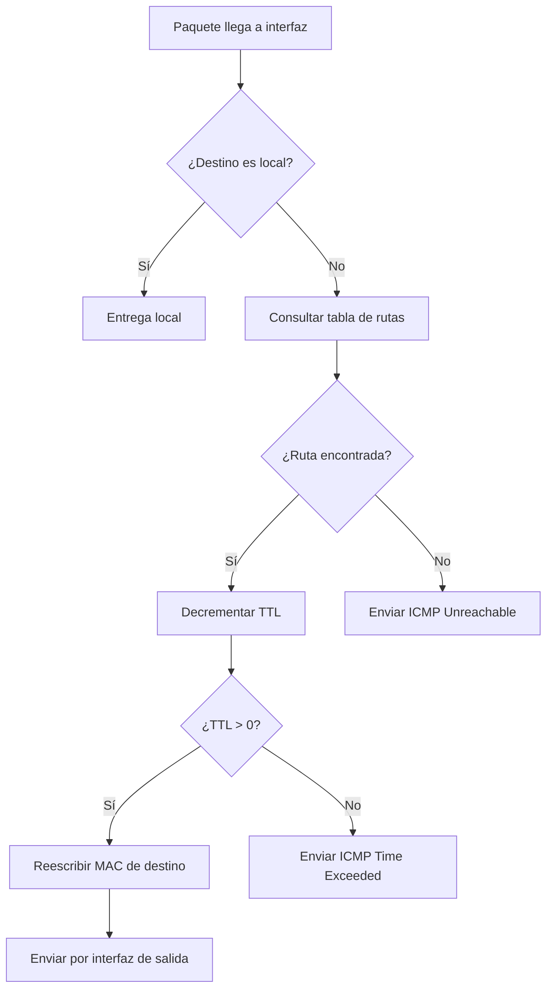
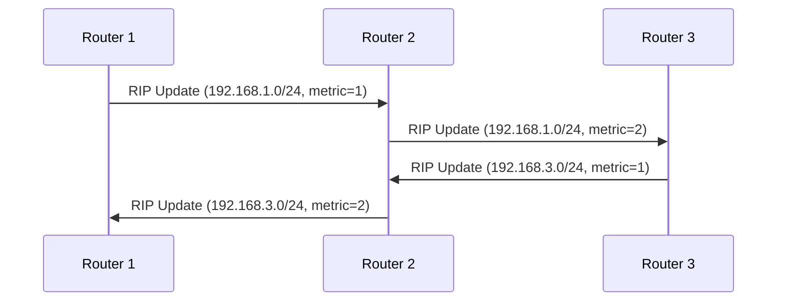
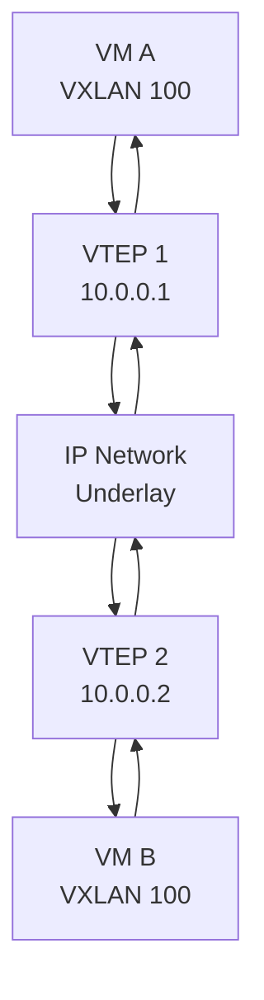

# MATERIAL ACADÉMICO COMPLETO
## GESTIÓN OPERATIVA Y SEGURIDAD EN REDES
### Unidades Temáticas 1 y 2

**Universidad Tecnológica Nacional - Facultad Regional La Plata**  
**Ingeniería en Sistemas de Información - 5º**  
**Docente:** Prof. Osvaldo Falabella
**Ayudante:** Emanuel Rodriguez

---

# UNIDAD TEMÁTICA Nº 1
## ADMINISTRACIÓN DE ROUTERS

### 🎯 **OBJETIVOS DE APRENDIZAJE**
Al finalizar esta unidad, el estudiante será capaz de:
- Explicar el funcionamiento interno de un router y sus componentes
- Configurar protocolos de enrutamiento estático y dinámico
- Administrar routers mediante diferentes métodos de acceso
- Implementar políticas de seguridad básicas en routers
- Automatizar tareas administrativas mediante scripting

---

## 📚 **1. INTRODUCCIÓN Y CONTEXTO HISTÓRICO**

### **1.1 Historia de los Routers**

El concepto de enrutamiento de paquetes nace en los años 1960 con el proyecto ARPANET, la precursora de Internet. Los primeros "routers" eran computadoras especializadas llamadas **Interface Message Processors (IMPs)**.

**Timeline Histórico:**
- **1969:** Primer IMP instalado en UCLA
- **1974:** Vint Cerf y Bob Kahn desarrollan TCP/IP
- **1981:** Cisco Systems funda por Leonard Bosack y Sandy Lerner
- **1984:** Primer router comercial Cisco (AGS)
- **1995:** Aparecen routers para el mercado masivo
- **2000s:** Routers inalámbricos y multi-servicio
- **2010s:** Software Defined Networking (SDN)
- **2020s:** Cloud-native routing y 5G integration

### **1.2 Evolución de RouterOS (MikroTik)**

**MikroTik** fue fundada en 1996 en Letonia por John Tully y Arnis Riekstins. Su historia:
- **1997:** Primera versión de RouterOS
- **2002:** Introducción de RouterBOARD hardware
- **2005:** Expansión global y certificaciones
- **2010:** Integración de tecnologías inalámbricas avanzadas
- **2015:** Container y virtualization support
- **2020:** Cloud integration y API REST

---

## 🧠 **2. CONCEPTOS FUNDAMENTALES**

### **2.1 ¿Qué es un Router?**

Un **router** es un dispositivo de red de **Capa 3 (Red)** del modelo OSI que:

```
┌─────────────────────────────────────────────────────────┐
│                    ROUTER                               │
│  ┌─────────────┐    ┌──────────────┐    ┌─────────────┐ │
│  │   Puerto    │    │  Procesador  │    │   Puerto    │ │
│  │  Ethernet   │◄──►│  Principal   │◄──►│  Ethernet   │ │
│  │     A       │    │   (CPU)      │    │     B       │ │
│  └─────────────┘    └──────────────┘    └─────────────┘ │
│                             │                           │
│                    ┌──────────────┐                     │
│                    │ Tabla de     │                     │
│                    │ Enrutamiento │                     │
│                    └──────────────┘                     │
└─────────────────────────────────────────────────────────┘
```

**Funciones principales:**
1. **Forwarding:** Envío de paquetes entre redes
2. **Routing:** Determinación de la mejor ruta
3. **Switching:** Conmutación de paquetes internamente
4. **Filtering:** Filtrado según políticas de seguridad

### **2.2 Anatomía de un Paquete IP**

```
 0                   1                   2                   3
 0 1 2 3 4 5 6 7 8 9 0 1 2 3 4 5 6 7 8 9 0 1 2 3 4 5 6 7 8 9 0 1
├─┼─┼─┼─┼─┼─┼─┼─┼─┼─┼─┼─┼─┼─┼─┼─┼─┼─┼─┼─┼─┼─┼─┼─┼─┼─┼─┼─┼─┼─┼─┼─┤
│Version│  IHL  │Type of Service│          Total Length         │
├─┼─┼─┼─┼─┼─┼─┼─┼─┼─┼─┼─┼─┼─┼─┼─┼─┼─┼─┼─┼─┼─┼─┼─┼─┼─┼─┼─┼─┼─┼─┼─┤
│         Identification        │Flags│      Fragment Offset    │
├─┼─┼─┼─┼─┼─┼─┼─┼─┼─┼─┼─┼─┼─┼─┼─┼─┼─┼─┼─┼─┼─┼─┼─┼─┼─┼─┼─┼─┼─┼─┼─┤
│  Time to Live │    Protocol   │         Header Checksum       │
├─┼─┼─┼─┼─┼─┼─┼─┼─┼─┼─┼─┼─┼─┼─┼─┼─┼─┼─┼─┼─┼─┼─┼─┼─┼─┼─┼─┼─┼─┼─┼─┤
│                    Source Address                             │
├─┼─┼─┼─┼─┼─┼─┼─┼─┼─┼─┼─┼─┼─┼─┼─┼─┼─┼─┼─┼─┼─┼─┼─┼─┼─┼─┼─┼─┼─┼─┼─┤
│                 Destination Address                           │
├─┼─┼─┼─┼─┼─┼─┼─┼─┼─┼─┼─┼─┼─┼─┼─┼─┼─┼─┼─┼─┼─┼─┼─┼─┼─┼─┼─┼─┼─┼─┼─┤
│                    Options                    │    Padding    │
└─┴─┴─┴─┴─┴─┴─┴─┴─┴─┴─┴─┴─┴─┴─┴─┴─┴─┴─┴─┴─┴─┴─┴─┴─┴─┴─┴─┴─┴─┴─┴─┘
```

**Campos clave para routing:**
- **TTL (Time to Live):** Previene loops infinitos
- **Source/Destination Address:** Direcciones IP origen y destino
- **Protocol:** Identifica el protocolo de capa superior (TCP=6, UDP=17)

### **2.3 Proceso de Reenvío de Paquetes**



---

## 🔧 **3. ARQUITECTURA DEL MIKROTIK RB951-2HnD**

### **3.1 Especificaciones Técnicas**

```
┌─────────────────────────────────────────────────────────────┐
│                MikroTik RB951-2HnD                          │
│                                                             │
│  ┌─────────┐  ┌─────────┐  ┌─────────┐  ┌─────────┐         │
│  │ ether1  │  │ ether2  │  │ ether3  │  │ ether4  │         │
│  │  WAN    │  │  LAN    │  │  LAN    │  │  LAN    │         │
│  └─────────┘  └─────────┘  └─────────┘  └─────────┘         │
│                                                             │
│              ┌─────────┐                ┌─────────┐         │
│              │ ether5  │                │ wlan1   │         │
│              │  LAN    │                │ 2.4GHz  │         │
│              └─────────┘                └─────────┘         │
│                                                             │
│  ┌─────────────────────────────────────────────────────┐    │
│  │        Atheros AR9344 600MHz CPU                    │    │
│  │        32MB DDR2 RAM                                │    │
│  │        16MB NOR Flash                               │    │
│  │        RouterOS License Level 4                     │    │
│  └─────────────────────────────────────────────────────┘    │
└─────────────────────────────────────────────────────────────┘
```

### **3.2 Arquitectura de RouterOS**

RouterOS utiliza una arquitectura de **kernel Linux modificado** con componentes especializados:

```
┌─────────────────────────────────────────────────────────┐
│                  RouterOS Architecture                  │
├─────────────────────────────────────────────────────────┤
│  User Space Applications                                │
│  ┌─────────┐ ┌─────────┐ ┌─────────┐ ┌─────────┐        │
│  │ Winbox  │ │ WebFig  │ │ SSH     │ │ Telnet  │        │
│  └─────────┘ └─────────┘ └─────────┘ └─────────┘        │
├─────────────────────────────────────────────────────────┤
│  RouterOS Services Layer                                │
│  ┌─────────┐ ┌─────────┐ ┌─────────┐ ┌─────────┐        │
│  │ Routing │ │ Bridge  │ │ WiFi    │ │ Security│        │
│  │ Engine  │ │ Engine  │ │ Engine  │ │ Engine  │        │
│  └─────────┘ └─────────┘ └─────────┘ └─────────┘        │
├─────────────────────────────────────────────────────────┤
│  Modified Linux Kernel 3.3.5                            │
├─────────────────────────────────────────────────────────┤
│  Hardware Abstraction Layer                             │
├─────────────────────────────────────────────────────────┤
│  Atheros AR9344 Hardware                                │
└─────────────────────────────────────────────────────────┘
```

---

## ⚙️ **4. CONFIGURACIÓN Y ADMINISTRACIÓN**

### **4.1 Métodos de Acceso**

#### **4.1.1 Winbox (Recomendado para laboratorio)**
- **Puerto:** UDP 8291
- **Ventajas:** Interfaz gráfica intuitiva, configuración visual
- **Uso típico:** Configuración inicial y administración diaria

#### **4.1.2 WebFig (HTTP/HTTPS)**
- **Puerto:** TCP 80/443
- **Ventajas:** Acceso desde cualquier navegador
- **Uso típico:** Administración remota y monitoreo

#### **4.1.3 SSH (Secure Shell)**
- **Puerto:** TCP 22
- **Ventajas:** Automatización, scripting, seguridad
- **Uso típico:** Configuraciones avanzadas y automatización

#### **4.1.4 Terminal (Console Port)**
- **Físico:** Mini-USB o puerto serie
- **Ventajas:** Acceso directo, recovery
- **Uso típico:** Troubleshooting y recuperación

### **4.2 Configuración Inicial Paso a Paso**

#### **4.2.1 Factory Reset**
```bash
# Método 1: Reset button (hardware)
# Mantener presionado 10 segundos después del encendido

# Método 2: Software reset
/system reset-configuration no-defaults=yes skip-backup=yes
```

#### **4.2.2 Configuración Básica**
```bash
# 1. Configurar identidad del router
/system identity set name="Router-Grupo1"

# 2. Configurar contraseñas
/user set admin password="admin123"
/user add name="estudiante" group="full" password="est123"

# 3. Configurar interfaces básicas
/interface ethernet set ether1 name="WAN"
/interface ethernet set ether2 name="LAN1"
/interface ethernet set ether3 name="LAN2"
/interface ethernet set ether4 name="LAN3"
/interface ethernet set ether5 name="LAN4"

# 4. Configurar direcciones IP
/ip address add address=192.168.1.1/24 interface=LAN1
/ip address add address=10.0.0.10/24 interface=WAN

# 5. Configurar gateway por defecto
/ip route add dst-address=0.0.0.0/0 gateway=10.0.0.1

# 6. Configurar DNS
/ip dns set servers=8.8.8.8,8.8.4.4 allow-remote-requests=yes
```

---

## 🛣️ **5. PROTOCOLOS DE ENRUTAMIENTO**

### **5.1 Enrutamiento Estático**

El enrutamiento estático requiere configuración manual de rutas. Es **determinístico** pero **no adaptativo**.

#### **5.1.1 Ventajas y Desventajas**

| Ventajas | Desventajas |
|----------|-------------|
| ✅ Control total sobre rutas | ❌ No se adapta a fallos |
| ✅ Bajo uso de CPU | ❌ Configuración manual intensiva |
| ✅ Predecible | ❌ No escala bien |
| ✅ Seguro (no broadcasts) | ❌ Difícil troubleshooting |

#### **5.1.2 Configuración de Rutas Estáticas**

```bash
# Ruta específica
/ip route add dst-address=192.168.2.0/24 gateway=10.0.0.2

# Ruta por defecto
/ip route add dst-address=0.0.0.0/0 gateway=10.0.0.1

# Ruta con interfaz específica
/ip route add dst-address=192.168.3.0/24 gateway=ether2

# Ruta con métrica (distance)
/ip route add dst-address=192.168.4.0/24 gateway=10.0.0.3 distance=10

# Ruta de backup
/ip route add dst-address=192.168.4.0/24 gateway=10.0.0.4 distance=20
```

### **5.2 Enrutamiento Dinámico**

Los protocolos dinámicos **intercambian información** automáticamente y se **adaptan a cambios** en la topología.

#### **5.2.1 RIP (Routing Information Protocol)**

**Características:**
- **Distance Vector Protocol**
- **Métrica:** Hop count (máximo 15)
- **Updates:** Cada 30 segundos
- **Convergencia:** Lenta (minutos)

```bash
# Configuración RIP básica
/routing rip interface add interface=ether1 send=v2 receive=v2
/routing rip interface add interface=ether2 send=v2 receive=v2
/routing rip network add network=10.0.0.0/24
/routing rip network add network=192.168.1.0/24

# Habilitar RIP
/routing rip set distribute-default=never redistribute-connected=yes
```

**Proceso de actualización RIP:**


#### **5.2.2 OSPF (Open Shortest Path First)**

**Características:**
- **Link State Protocol**
- **Métrica:** Cost (basado en bandwidth)
- **Updates:** Triggered by changes
- **Convergencia:** Rápida (segundos)

```bash
# Configuración OSPF básica
/routing ospf instance set default redistribute-connected=as-external-1

# Configurar áreas y redes
/routing ospf area add name="backbone" area-id=0.0.0.0
/routing ospf network add network=10.0.0.0/24 area=backbone
/routing ospf network add network=192.168.1.0/24 area=backbone

# Configurar interfaces
/routing ospf interface add interface=ether1 cost=10
/routing ospf interface add interface=ether2 cost=10
```

**Base de datos OSPF:**
```
┌─────────────────────────────────────────────────────────┐
│                OSPF Database                            │
├─────────────────────────────────────────────────────────┤
│  LSA Type 1 - Router LSAs                               │
│  ┌─────────┐ ┌─────────┐ ┌─────────┐                   │
│  │Router A │ │Router B │ │Router C │                   │
│  └─────────┘ └─────────┘ └─────────┘                   │
├─────────────────────────────────────────────────────────┤
│  LSA Type 2 - Network LSAs                              │
│  ┌─────────────────────────────────────────────────┐   │
│  │           Network Information               │   │
│  └─────────────────────────────────────────────────┘   │
├─────────────────────────────────────────────────────────┤
│  Shortest Path Tree (SPF)                               │
│          Router A                                       │
│         /        \                                      │
│    Router B  ←→  Router C                               │
└─────────────────────────────────────────────────────────┘
```

---

## 🔒 **6. SEGURIDAD BÁSICA EN ROUTERS**

### **6.1 Hardening Básico**

```bash
# 1. Cambiar puertos por defecto
/ip service set ssh port=2222
/ip service set winbox port=8292

# 2. Deshabilitar servicios innecesarios
/ip service disable telnet
/ip service disable ftp
/ip service disable www

# 3. Configurar firewall básico
/ip firewall filter add chain=input action=accept connection-state=established,related
/ip firewall filter add chain=input action=accept src-address=192.168.1.0/24
/ip firewall filter add chain=input action=drop

# 4. Configurar rate limiting para SSH
/ip firewall filter add chain=input protocol=tcp dst-port=2222 \
    connection-state=new src-address-list=ssh_blacklist action=drop

/ip firewall filter add chain=input protocol=tcp dst-port=2222 \
    connection-state=new limit=3,5:packet \
    action=add-src-to-address-list address-list=ssh_blacklist \
    address-list-timeout=1d
```

### **6.2 Backup y Restauración**

```bash
# Crear backup completo
/export compact file=backup-$(date +%Y%m%d)

# Backup de configuración específica
/ip firewall export file=firewall-rules
/routing export file=routing-config

# Restaurar configuración
/import backup-20240815.rsc

# Reset y restaurar
/system reset-configuration no-defaults=yes skip-backup=yes
# Después del reinicio:
/import backup-20240815.rsc
```

---

# 🌐 UNIDAD TEMÁTICA Nº 2
## CONFIGURACIÓN DE REDES VIRTUALES

### 🎯 **OBJETIVOS DE APRENDIZAJE**
Al finalizar esta unidad, el estudiante será capaz de:
- Explicar los conceptos fundamentales de virtualización de redes
- Configurar VLANs y implementar segmentación de red
- Diseñar arquitecturas de red escalables usando tecnologías de virtualización
- Implementar inter-VLAN routing y políticas de seguridad
- Evaluar tecnologías emergentes como VXLAN y SDN

---

## 📚 **1. INTRODUCCIÓN A LA VIRTUALIZACIÓN DE REDES**

### **1.1 Historia y Evolución**

La virtualización de redes surge de la necesidad de **segmentar** y **optimizar** el uso de la infraestructura física.

**Timeline histórico:**
- **1980s:** Primeros conceptos de LAN segmentation
- **1998:** IEEE 802.1Q standard para VLAN tagging
- **2003:** VMware introduce virtual switches
- **2009:** Nicira (luego VMware NSX) desarrolla SDN
- **2011:** OpenFlow protocol para SDN
- **2014:** VXLAN RFC 7348 publicado
- **2020s:** Cloud-native networking y service mesh

### **1.2 ¿Por qué Virtualizar Redes?**

**Problemas tradicionales:**
```
Physical Network Problems:
┌─────────────────────────────────────────────────────────┐
│  [PC1] [PC2] [PC3] [PC4] [PC5] [PC6] [PC7] [PC8]       │
│    │     │     │     │     │     │     │     │         │
│    └─────┴─────┴─────┴─────┴─────┴─────┴─────┴─────    │
│                        │                               │
│                 [Single Switch]                        │
│                                                         │
│  ❌ Single broadcast domain                             │
│  ❌ No traffic isolation                                │
│  ❌ Security vulnerabilities                            │
│  ❌ Poor scalability                                    │
└─────────────────────────────────────────────────────────┘
```

**Solución con VLANs:**
```
Virtualized Network Solution:
┌─────────────────────────────────────────────────────────┐
│     VLAN 10        VLAN 20        VLAN 30               │
│  [PC1] [PC2]    [PC3] [PC4]    [PC5] [PC6]             │
│    │     │        │     │        │     │               │
│    └─────┴────────┴─────┴────────┴─────┴─────          │
│                        │                               │
│              [Managed Switch]                          │
│                                                         │
│  ✅ Multiple broadcast domains                          │
│  ✅ Traffic isolation                                   │
│  ✅ Enhanced security                                   │
│  ✅ Better scalability                                  │
└─────────────────────────────────────────────────────────┘
```

---

## 🏷️ **2. VIRTUAL LANs (VLANs)**

### **2.1 Conceptos Fundamentales**

Una **VLAN** (Virtual Local Area Network) es una **agrupación lógica** de dispositivos que pueden comunicarse como si estuvieran en el mismo segmento de red físico, independientemente de su ubicación física.

#### **2.1.1 Características Clave**
- **Aislamiento:** Cada VLAN es un dominio de broadcast separado
- **Flexibilidad:** Dispositivos pueden cambiar de VLAN sin mover cables
- **Seguridad:** Tráfico entre VLANs requiere routing explicito
- **Escalabilidad:** Hasta 4094 VLANs por switch (IEEE 802.1Q)

### **2.2 IEEE 802.1Q VLAN Tagging**

El estándar **802.1Q** inserta un **tag de 4 bytes** en el frame Ethernet:

```
Original Ethernet Frame:
┌─────────────┬─────────────┬──────┬─────────┬─────┐
│ Destination │   Source    │ Type │  Data   │ FCS │
│   MAC (6)   │   MAC (6)   │ (2)  │         │ (4) │
└─────────────┴─────────────┴──────┴─────────┴─────┘

802.1Q Tagged Frame:
┌─────────────┬─────────────┬───────────┬──────┬─────────┬─────┐
│ Destination │   Source    │ 802.1Q    │ Type │  Data   │ FCS │
│   MAC (6)   │   MAC (6)   │  Tag (4)  │ (2)  │         │ (4) │
└─────────────┴─────────────┴───────────┴──────┴─────────┴─────┘

802.1Q Tag Structure (4 bytes):
┌────────────────┬─────┬─────┬─────────────────────┐
│     TPID       │ PCP │ DEI │       VID           │
│   (16 bits)    │(3b) │(1b) │    (12 bits)        │
│    0x8100      │     │     │   VLAN ID 1-4094    │
└────────────────┴─────┴─────┴─────────────────────┘
```

**Campos del 802.1Q Tag:**
- **TPID (Tag Protocol Identifier):** 0x8100 (identifica frame como tagged)
- **PCP (Priority Code Point):** 3 bits para QoS (0-7)
- **DEI (Drop Eligible Indicator):** 1 bit para congestión
- **VID (VLAN Identifier):** 12 bits para VLAN ID (1-4094)

### **2.3 Tipos de Puertos VLAN**

#### **2.3.1 Access Ports**
- **Propósito:** Conectar dispositivos finales (PCs, servers)
- **Comportamiento:** Remueve/agrega tags automáticamente
- **VLAN:** Pertenece a una sola VLAN

#### **2.3.2 Trunk Ports**
- **Propósito:** Conectar switches entre sí
- **Comportamiento:** Transporta múltiples VLANs con tags
- **VLAN Nativa:** VLAN que viaja sin tag (por defecto VLAN 1)

```
Access Port Configuration:
┌─────────┐     ┌─────────────┐     ┌─────────┐
│   PC    │────►│    Switch   │────►│ Router  │
│         │     │ Access Port │     │         │
└─────────┘     │  VLAN 10    │     └─────────┘
Untagged        └─────────────┘     Tagged
Frame           Adds VLAN 10 tag     Frame

Trunk Port Configuration:
┌─────────────┐                 ┌─────────────┐
│   Switch A  │                 │   Switch B  │
│             │ VLAN 10,20,30   │             │
│ Trunk Port  │◄───────────────►│ Trunk Port  │
│             │   Tagged        │             │
└─────────────┘   Frames        └─────────────┘
```

---

## ⚙️ **3. CONFIGURACIÓN DE VLANS EN MIKROTIK**

### **3.1 Arquitectura Bridge vs Switch**

MikroTik ofrece dos enfoques para VLANs:

#### **3.1.1 Bridge VLAN Filtering (Recomendado)**
```bash
# 1. Crear bridge principal
/interface bridge add name=bridge-vlans vlan-filtering=yes

# 2. Agregar interfaces físicas al bridge
/interface bridge port add bridge=bridge-vlans interface=ether2
/interface bridge port add bridge=bridge-vlans interface=ether3
/interface bridge port add bridge=bridge-vlans interface=ether4
/interface bridge port add bridge=bridge-vlans interface=ether5

# 3. Crear interfaces VLAN
/interface vlan add name=vlan10 vlan-id=10 interface=bridge-vlans
/interface vlan add name=vlan20 vlan-id=20 interface=bridge-vlans
/interface vlan add name=vlan30 vlan-id=30 interface=bridge-vlans

# 4. Configurar VLANs en el bridge
/interface bridge vlan add bridge=bridge-vlans tagged=ether5 untagged=ether2 vlan-ids=10
/interface bridge vlan add bridge=bridge-vlans tagged=ether5 untagged=ether3 vlan-ids=20
/interface bridge vlan add bridge=bridge-vlans tagged=ether5 untagged=ether4 vlan-ids=30

# 5. Configurar PVID para access ports
/interface bridge port set bridge=bridge-vlans interface=ether2 pvid=10
/interface bridge port set bridge=bridge-vlans interface=ether3 pvid=20
/interface bridge port set bridge=bridge-vlans interface=ether4 pvid=30
```

### **3.2 Configuración Paso a Paso Completa**

#### **3.2.1 Escenario de Laboratorio**
```
Topología objetivo:
┌─────────────────────────────────────────────────────────┐
│                Router MikroTik                          │
│  ┌─────────┐ ┌─────────┐ ┌─────────┐ ┌─────────┐       │
│  │ ether2  │ │ ether3  │ │ ether4  │ │ ether5  │       │
│  │VLAN 10  │ │VLAN 20  │ │VLAN 30  │ │ TRUNK   │       │
│  │ Access  │ │ Access  │ │ Access  │ │         │       │
│  └─────────┘ └─────────┘ └─────────┘ └─────────┘       │
│      │           │           │           │             │
│  ┌─────────┐ ┌─────────┐ ┌─────────┐     │             │
│  │   PC1   │ │   PC2   │ │   PC3   │     │             │
│  │ Admin   │ │ Users   │ │ Guests  │     │             │
│  └─────────┘ └─────────┘ └─────────┘     │             │
│                                          │             │
│                              ┌─────────────────────┐   │
│                              │    Other Switch     │   │
│                              │   (Trunk Link)      │   │
│                              └─────────────────────┘   │
└─────────────────────────────────────────────────────────┘
```

#### **3.2.2 Script de Configuración Completo**

```bash
# ========================================
# CONFIGURACIÓN COMPLETA DE VLANs
# MikroTik RB951-2HnD
# ========================================

# 1. Reset a configuración base
/interface bridge remove [find]
/interface vlan remove [find]
/ip address remove [find where interface~"vlan"]

# 2. Crear bridge principal con VLAN filtering
/interface bridge add name=br-main vlan-filtering=yes

# 3. Agregar puertos físicos al bridge
/interface bridge port add bridge=br-main interface=ether2 comment="Access VLAN 10"
/interface bridge port add bridge=br-main interface=ether3 comment="Access VLAN 20"  
/interface bridge port add bridge=br-main interface=ether4 comment="Access VLAN 30"
/interface bridge port add bridge=br-main interface=ether5 comment="Trunk Port"

# 4. Crear interfaces VLAN para routing
/interface vlan add name=vlan10-admin vlan-id=10 interface=br-main
/interface vlan add name=vlan20-users vlan-id=20 interface=br-main
/interface vlan add name=vlan30-guests vlan-id=30 interface=br-main

# 5. Configurar VLAN membership en bridge
/interface bridge vlan add bridge=br-main tagged=br-main,ether5 untagged=ether2 vlan-ids=10
/interface bridge vlan add bridge=br-main tagged=br-main,ether5 untagged=ether3 vlan-ids=20
/interface bridge vlan add bridge=br-main tagged=br-main,ether5 untagged=ether4 vlan-ids=30

# 6. Configurar PVID para access ports
/interface bridge port set [find interface=ether2] pvid=10
/interface bridge port set [find interface=ether3] pvid=20
/interface bridge port set [find interface=ether4] pvid=30

# 7. Configurar direcciones IP para cada VLAN
/ip address add address=192.168.10.1/24 interface=vlan10-admin comment="Admin Network"
/ip address add address=192.168.20.1/24 interface=vlan20-users comment="Users Network"
/ip address add address=192.168.30.1/24 interface=vlan30-guests comment="Guests Network"

# 8. Configurar DHCP para cada VLAN
/ip pool add name=pool-admin ranges=192.168.10.100-192.168.10.200
/ip pool add name=pool-users ranges=192.168.20.100-192.168.20.200
/ip pool add name=pool-guests ranges=192.168.30.100-192.168.30.200

/ip dhcp-server add name=dhcp-admin interface=vlan10-admin address-pool=pool-admin disabled=no
/ip dhcp-server add name=dhcp-users interface=vlan20-users address-pool=pool-users disabled=no
/ip dhcp-server add name=dhcp-guests interface=vlan30-guests address-pool=pool-guests disabled=no

/ip dhcp-server network add address=192.168.10.0/24 gateway=192.168.10.1 dns-server=192.168.10.1
/ip dhcp-server network add address=192.168.20.0/24 gateway=192.168.20.1 dns-server=192.168.20.1
/ip dhcp-server network add address=192.168.30.0/24 gateway=192.168.30.1 dns-server=192.168.30.1

# 9. Configurar firewall básico para segmentación
/ip firewall filter add chain=forward action=accept src-address=192.168.10.0/24 comment="Admin full access"
/ip firewall filter add chain=forward action=accept src-address=192.168.20.0/24 dst-address=!192.168.10.0/24 comment="Users limited access"
/ip firewall filter add chain=forward action=accept src-address=192.168.30.0/24 dst-address=!192.168.0.0/16 comment="Guests internet only"
/ip firewall filter add chain=forward action=drop comment="Drop remaining inter-VLAN traffic"

# 10. Habilitar VLAN filtering (¡IMPORTANTE: Hacer último!)
/interface bridge set br-main vlan-filtering=yes
```

### **3.3 Troubleshooting VLANs**

#### **3.3.1 Comandos de Diagnóstico**

```bash
# Verificar configuración de bridge
/interface bridge print detail
/interface bridge port print detail
/interface bridge vlan print

# Verificar tags en interfaces
/interface vlan print detail

# Monitorear tráfico por VLAN
/tool sniffer quick interface=ether2 duration=10

# Verificar tabla MAC
/interface bridge host print

# Verificar estado de puertos
/interface bridge port monitor [find interface=ether2]

# Ver estadísticas de VLAN
/interface monitor-traffic interface=vlan10-admin duration=5
```

#### **3.3.2 Problemas Comunes y Soluciones**

| Problema | Síntoma | Solución |
|----------|---------|----------|
| **No comunicación entre VLANs** | PC en diferentes VLANs no se comunican | Verificar configuración de routing y firewall |
| **VLAN tags no funcionan** | Trunk port no transporta VLANs | Verificar configuración de bridge vlan y tagged ports |
| **DHCP no funciona en VLAN** | Clientes no obtienen IP | Verificar DHCP server en interfaz VLAN correcta |
| **Performance degradado** | Lentitud en switching | Verificar que VLAN filtering esté habilitado en bridge |

---

## 🚀 **4. TECNOLOGÍAS AVANZADAS**

### **4.1 VXLAN (Virtual Extensible LAN)**

**VXLAN** extiende VLANs sobre redes IP, superando las limitaciones de 802.1Q.

#### **4.1.1 Limitaciones de VLANs Tradicionales**
- **Límite de 4094 VLANs** (12 bits)
- **Flooding en L2** afecta performance
- **Spanning Tree** limita uso de links
- **No funciona sobre L3** (Internet)

#### **4.1.2 Arquitectura VXLAN**

```
VXLAN Encapsulation:
┌─────────────────────────────────────────────────────────┐
│                Outer Headers                            │
├─────────────────────────────────────────────────────────┤
│  Outer Ethernet │ Outer IP │ Outer UDP │ VXLAN Header  │
│     Header      │  Header  │  Header   │   (8 bytes)   │
├─────────────────────────────────────────────────────────┤
│                Original Ethernet Frame                  │
│  Inner Ethernet │ Inner IP │ Inner TCP │    Data       │
│     Header      │  Header  │  Header   │               │
└─────────────────────────────────────────────────────────┘

VXLAN Header Structure:
┌───────┬───────┬───────┬─────────────────────────────────┐
│ Flags │ Rsvd  │ Rsvd  │            VNI                  │
│ (8b)  │ (8b)  │ (8b)  │      (24 bits)                  │
│ 0x08  │ 0x00  │ 0x00  │  16M possible networks          │
└───────┴───────┴───────┴─────────────────────────────────┘
```

#### **4.1.3 VTEP (VXLAN Tunnel Endpoints)**



### **4.2 Software Defined Networking (SDN)**

#### **4.2.1 Conceptos Clave**

**SDN** separa el **plano de control** del **plano de datos**, centralizando la inteligencia de red.

```
Traditional Network:
┌─────────────┐ ┌─────────────┐ ┌─────────────┐
│   Switch    │ │   Switch    │ │   Switch    │
│ ┌─────────┐ │ │ ┌─────────┐ │ │ ┌─────────┐ │
│ │Control  │ │ │ │Control  │ │ │ │Control  │ │
│ │ Plane   │ │ │ │ Plane   │ │ │ │ Plane   │ │
│ └─────────┘ │ │ └─────────┘ │ │ └─────────┘ │
│ ┌─────────┐ │ │ ┌─────────┐ │ │ ┌─────────┐ │
│ │ Data    │ │ │ │ Data    │ │ │ │ Data    │ │
│ │ Plane   │ │ │ │ Plane   │ │ │ │ Plane   │ │
│ └─────────┘ │ │ └─────────┘ │ │ └─────────┘ │
└─────────────┘ └─────────────┘ └─────────────┘

SDN Network:
                ┌─────────────────┐
                │   Controller    │
                │  (Control Plane)│
                └─────────────────┘
                         │
             ┌───────────┼───────────┐
             │           │           │
┌─────────────┐ ┌─────────────┐ ┌─────────────┐
│   Switch    │ │   Switch    │ │   Switch    │
│ ┌─────────┐ │ │ ┌─────────┐ │ │ ┌─────────┐ │
│ │ Data    │ │ │ │ Data    │ │ │ │ Data    │ │
│ │ Plane   │ │ │ │ Plane   │ │ │ │ Plane   │ │
│ └─────────┘ │ │ └─────────┘ │ │ └─────────┘ │
└─────────────┘ └─────────────┘ └─────────────┘
```

---

## 📚 **BIBLIOGRAFÍA Y REFERENCIAS**

### **Referencias Principales**
1. **Tanenbaum, A. S., & Wetherall, D. J.** (2011). *Computer Networks* (5th ed.). Pearson Education. ISBN: 978-0132126953
2. **Kurose, J. F., & Ross, K. W.** (2021). *Computer Networking: A Top-Down Approach* (8th ed.). Pearson. ISBN: 978-0135928615
3. **Doyle, J., & Carroll, J.** (2016). *Routing TCP/IP, Volume 1* (2nd ed.). Cisco Press. ISBN: 978-1587052026

### **Documentación Técnica**
4. **MikroTik Documentation.** (2024). *RouterOS Manual*. Retrieved from https://help.mikrotik.com/
5. **RFC 791.** (1981). *Internet Protocol - DARPA Internet Program Protocol Specification*. IETF.
6. **RFC 7348.** (2014). *Virtual eXtensible Local Area Network (VXLAN): A Framework for Overlaying Virtualized Layer 2 Networks over Layer 3 Networks*. IETF.
7. **IEEE 802.1Q-2018.** *IEEE Standard for Local and Metropolitan Area Networks--Bridges and Bridged Networks*.

### **Libros Especializados**
8. **Sportack, M.** (2022). *IP Routing Fundamentals*. Cisco Press. ISBN: 978-1587144233
9. **Edgeworth, B., Foss, A., & Garza Rios, R.** (2021). *IP Routing on Cisco IOS, IOS XE, and IOS XR*. Cisco Press. ISBN: 978-1587145926
10. **Dutt, D. G.** (2021). *Cloud Native Data Center Networking* (2nd ed.). O'Reilly Media. ISBN: 978-1492045601

---

## 🎥 **RECURSOS MULTIMEDIA**

### **Canales de YouTube Especializados**

#### **1. Administración de Routers**
- **NetworkChuck**
  - "Router vs Switch - What's the difference?" - https://youtu.be/1z0ULvg_pW8
  - "Routers and Routing Explained" - https://youtu.be/AhOU1uA8w2k
  - **Relevancia:** Explicaciones claras y visuales, ideal para conceptos básicos

- **David Bombal**
  - "MikroTik RouterOS Configuration" - https://youtu.be/f-vD5Reh8qE
  - "OSPF vs RIP vs EIGRP" - https://youtu.be/8V6UI-fZMXQ
  - **Relevancia:** Labs prácticos con equipos reales, configuraciones paso a paso

- **MikroTik Academy**
  - "RouterOS First Time Configuration" - https://youtu.be/sNbWrLbCJNE
  - "RouterOS Scripting Basics" - https://youtu.be/6IQaFwCY4xg
  - **Relevancia:** Contenido oficial, configuraciones certificadas

#### **2. Redes Virtuales y VLANs**
- **PowerCert Animated Videos**
  - "VLANs Explained" - https://youtu.be/jC6MJTh9fRE
  - "VLAN Trunking Explained" - https://youtu.be/V5aUB2YPcmU
  - **Relevancia:** Animaciones didácticas, conceptos visualizados

- **Jeremy's IT Lab**
  - "VLANs - Free CCNA Course" - https://youtu.be/MmwF1oHOvmg
  - "VLAN Configuration Lab" - https://youtu.be/a8K1A3JPbWQ
  - **Relevancia:** Curso estructurado, laboratorios gratuitos

- **CBT Nuggets**
  - "VLAN Configuration and Troubleshooting" - https://youtu.be/A9lMH0ye1HU
  - "Inter-VLAN Routing Methods" - https://youtu.be/kbqh1U-a6v8
  - **Relevancia:** Enfoque profesional, troubleshooting avanzado

#### **3. Tecnologías Avanzadas**
- **VMware**
  - "NSX Data Center Overview" - https://youtu.be/ixRGiD_c7qc
  - "VXLAN Fundamentals" - https://youtu.be/Jqm_4TMmQz0
  - **Relevancia:** Tecnologías enterprise, SDN concepts

- **Cisco**
  - "ACI Architecture Deep Dive" - https://youtu.be/Kk4c1bfHWq4
  - "Software Defined Networking Explained" - https://youtu.be/DiChnu_PAzI
  - **Relevancia:** Visión industrial, casos de uso reales

---

---
